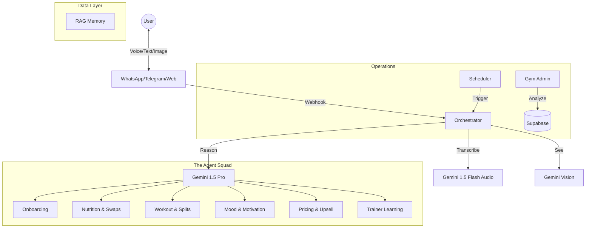

# DailyFit AI: Ultimate Architecture & Innovation Guide

## 🏗 System Architecture (Final State)

DailyFit AI is now a **Multi-Modal, Multi-Agent Ecosystem** designed to provide 360° fitness coaching. It has evolved from a simple chatbot into a complex mesh of 8 specialized agents.

### High-Level Mesh

### The 8 Specialized Agents
1.  **NutritionPlanGeneratorAgent**: Handles diet, cultural context (Indian/Mexican/etc.), and suggests food swaps.
2.  **WorkoutGeneratorAgent**: Manages splits (PPL/Upper-Lower), injuries, and progressive overload.
3.  **TrainerOverrideLearningAgent**: "Watches" human edits to learn rules (e.g., "Trainer X hates Burpees") improving future AI plans.
4.  **ProgressAnalysisAgent**: Runs weekly cron jobs to generate deep reports on adherence and weight trends.
5.  **MotivationAgent**: Detects **Mood** (Stressed/Happy) from text/voice and switches personas (Empathetic Friend vs. Drill Sergeant).
6.  **GymAdminAgent**: Analyzes business metrics (Churn, Active Clients) for the gym owner.
7.  **PricingUpsellAgent**: Identifies "Super Users" ready for premium tier upgrades.
8.  **NotificationSchedulerAgent**: Orchestrates the timing of morning briefings and weekly reports.

---

## 📅 Daily Utility: The "Life OS" for Fitness

This is how the agent integrates into a user's actual life, creating high retention:

*   **07:00 AM (The Nudge)**: "Good morning, Sarah! ☀️ Ready for Leg Day? Drink 500ml water first."
*   **On-Demand (Nutrition Analysis)**: Sarah snaps a pic of her dosa. **VisionAI** instantly calculates: "Masala Dosa, 350kcal, 8g Protein." (Provides instant macro data without requiring strict daily tracking).
*   **01:00 PM (Smart Swap)**: "I'm at a cafe, no access to healthy food." -> **Nutrition Agent**: "Order a Grilled Chicken Salad or an Iced Americano. Avoid the dressing."
*   **06:00 PM (Voice Coaching)**: Sarah sends a Voice Note: "My knee hurts during squats." -> **Workout Agent**: "Stop immediately. Switch to Wall Sits for today. I'll note this injury."
*   **09:30 PM (Reflection)**: "I feel great." -> **Motivation Agent** (Cheerleader Mode): "You crushed it today! Rest up for tomorrow."

---

## 🚀 Game Changer Ideas (Phase 9 & 10)

To take this from a "Product" to a "Platform", consider these innovative leaps:

### 1. The "Smart Gym" Integration (IoT)
*   **Concept**: The AI knows *exactly* what you did at the gym without you typing it.
*   **How**: Integrate with connecting equipment (Technogym/Peloton API) or simple NFC tags on machines.
*   **Game Changer**: "I see you ran 5km on the treadmill. I've adjusted your calorie target up by 300kcal automatically."

### 2. White-Label "Trainer clone"
*   **Concept**: Sell this software to *other* celebrity trainers.
*   **How**: Use the **TrainerOverrideLearningAgent** to ingest a new trainer's PDF guides and YouTube videos.
*   **Game Changer**: "Train with [Celebrity Name] AI". The AI mimics their voice, style, and philosophy perfectly.

### 3. Real-Time Form Correction (Computer Vision)
*   **Concept**: Personal Training via camera.
*   **How**: User props up phone -> Records set -> Gemini 1.5 Pro (Video) analyzes form.
*   **Game Changer**: "Your back was arching on rep 8. Keep your core tight next time."

### 4. Grocery Delivery API
*   **Concept**: Frictionless Diet Compliance.
*   **How**: The **Nutrition Agent** generates the plan -> "Click to order ingredients on Instacart/Blinkit".
*   **Game Changer**: Removes the excuse of "I didn't have the food."

### 5. Social "Squad Challenges"
*   **Concept**: Multiplayer Fitness.
*   **How**: AI acts as the referee in a WhatsApp Group. "Sarah just finished her workout! @John, you're falling behind."
*   **Game Changer**: Social pressure is the #1 driver of adherence.

### 6. Bio-Feedback Loop (Apple Health/Whoop)
*   **Concept**: Hyper-Personalization based on recovery.
*   **How**: Sync with Apple Health. If HRV is low (Stress high), the **Workout Agent** automatically downgrades the workout to "Active Recovery" before the user even wakes up.
*   **Game Changer**: Truly injury-preventative coaching.
